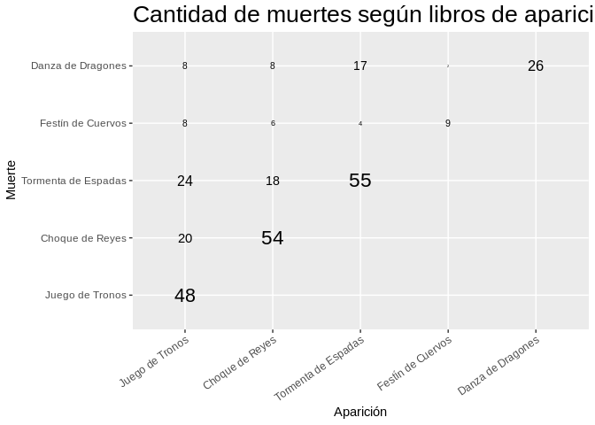
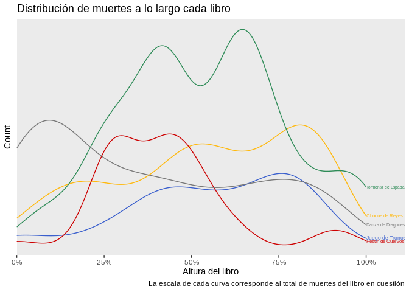
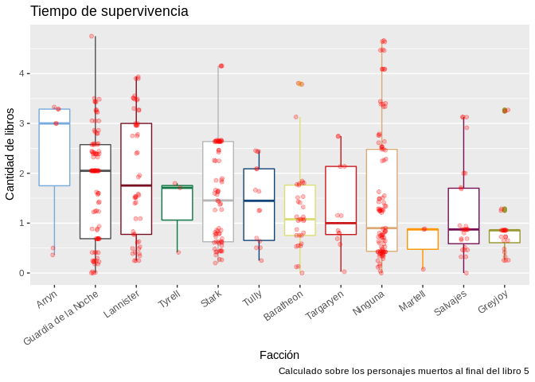
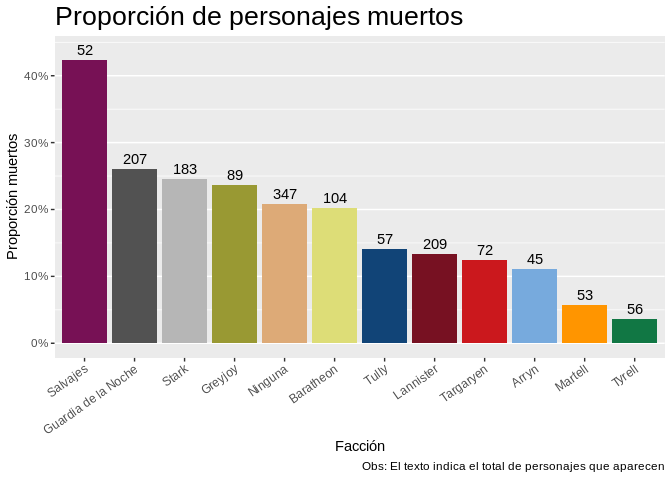
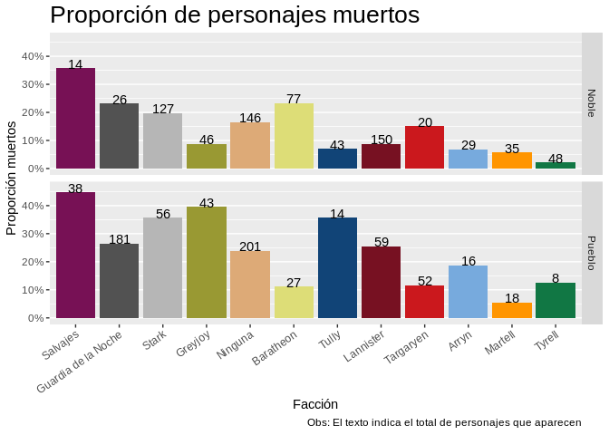
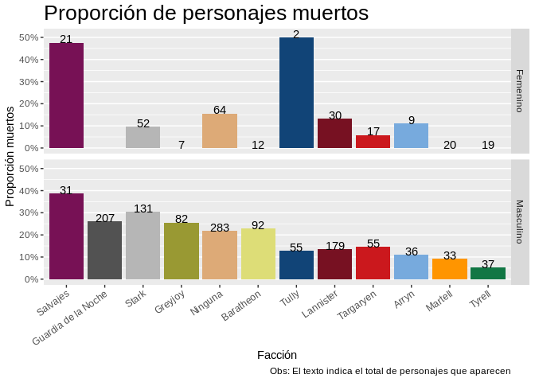
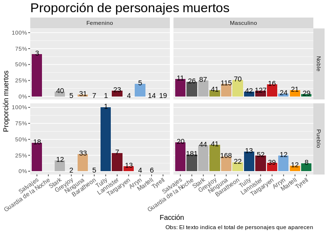
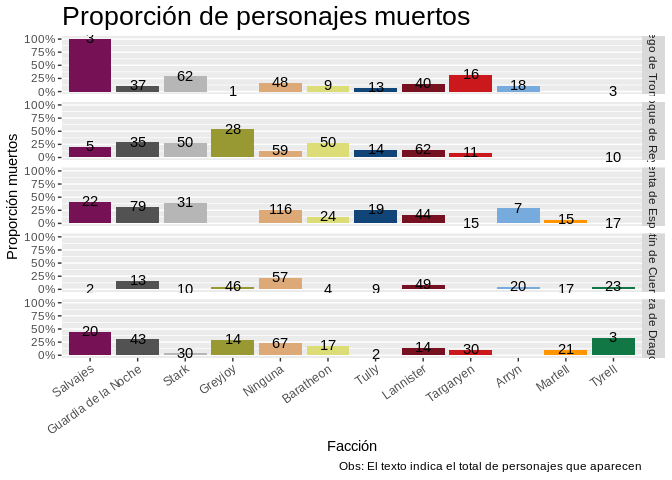
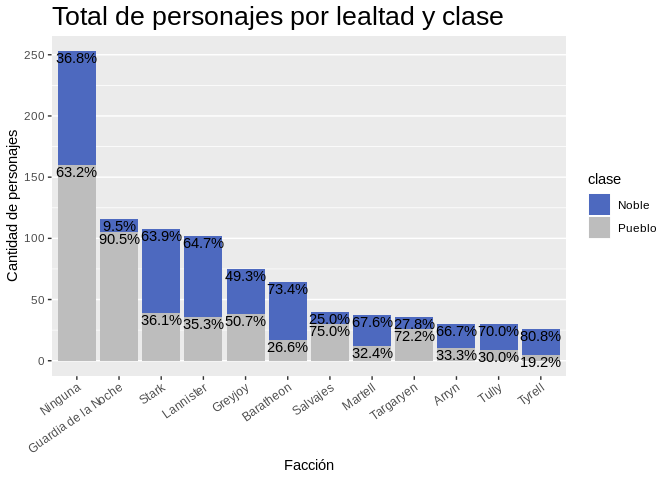

Datos de miércoles: GoT
================
Maestre Yandel
2019-04-21

-   [Carga de datos](#carga-de-datos)
-   [Exploración de la estructura de los datos](#exploración-de-la-estructura-de-los-datos)
    -   [Tablas TV](#tablas-tv)
    -   [Tabla libros](#tabla-libros)
-   [Data wrangle](#data-wrangle)
-   [Visualización de datos de los libros](#visualización-de-datos-de-los-libros)
    -   [¿Cuánto tardan los personajes en morir, desde que aparecen?](#cuánto-tardan-los-personajes-en-morir-desde-que-aparecen)
    -   [¿En qué momento de los libros mueren los personajes?](#en-qué-momento-de-los-libros-mueren-los-personajes)
    -   [¿Cuánto tardan en morir los personajes de cada facción?](#cuánto-tardan-en-morir-los-personajes-de-cada-facción)
    -   [Tasas de mortalidad por facción](#tasas-de-mortalidad-por-facción)
    -   [Proporción de nobles y plebeyos](#proporción-de-nobles-y-plebeyos)

Carga de datos
==============

Cargo los paquetes y datos a utilizar.

``` r
library(magrittr)
library(tidyverse)
library(stringr)


tiempo_pantalla <- data.table::fread("https://raw.githubusercontent.com/cienciadedatos/datos-de-miercoles/master/datos/2019/2019-04-17/tiempo_pantalla.csv", encoding = 'UTF-8')
cambio_lealtades <- data.table::fread("https://raw.githubusercontent.com/cienciadedatos/datos-de-miercoles/master/datos/2019/2019-04-17/cambio_lealtades.csv", encoding = 'UTF-8')
personajes_libros <- data.table::fread("https://raw.githubusercontent.com/cienciadedatos/datos-de-miercoles/master/datos/2019/2019-04-17/personajes_libro.csv", encoding = 'UTF-8')

# Arreglo libro de muerte del Maestre Cressen:
personajes_libros[nombre == 'Cressen', libro_muerte := 2]
```

Exploración de la estructura de los datos
=========================================

Tablas TV
---------

¿Qué data tengo?

``` r
glimpse(tiempo_pantalla)
```

    ## Observations: 191
    ## Variables: 3
    ## $ nombre           <chr> "Tyrion Lannister", "Jon Nieve", "Daenerys Targ…
    ## $ minutos_pantalla <dbl> 293.30, 268.15, 221.30, 201.45, 199.30, 189.15,…
    ## $ episodios        <int> 54, 49, 49, 52, 47, 47, 43, 39, 37, 42, 35, 16,…

tiempo\_pantalla trae básicamente dos métricas de la importancia de cada personaje.

``` r
glimpse(cambio_lealtades)
```

    ## Observations: 488
    ## Variables: 11
    ## $ nombre          <chr> "Tyrion Lannister", "Cersei Lannister", "Daenery…
    ## $ origen          <chr> "Casa Lannister", "Casa Lannister", "Casa Targar…
    ## $ lealtad_inicial <chr> "Rey Robert Baratheon", "Rey Robert Baratheon", …
    ## $ fin_t1          <chr> "Rey Joffrey Baratheon", "Rey Joffrey Baratheon"…
    ## $ fin_t2          <chr> "Rey Joffrey Baratheon", "Rey Joffrey Baratheon"…
    ## $ fin_t3          <chr> "Rey Joffrey Baratheon", "Rey Joffrey Baratheon"…
    ## $ fin_t4          <chr> "Rey Tommen Baratheon", "Rey Tommen Baratheon", …
    ## $ fin_t5          <chr> "Daenerys Targaryen", "Rey Tommen Baratheon", "D…
    ## $ fin_t6          <chr> "Daenerys Targaryen", "Reina Cersei Lannister", …
    ## $ fin_t7          <chr> "Daenerys Targaryen", "Reina Cersei Lannister", …
    ## $ episodios       <int> 61, 58, 56, 56, 54, 53, 49, 48, 43, 43, 41, 41, …

Trae más varibles con las que jugar. También más observaciones, así que para muchos personajes vamos a saber la lealtad pero no los minutos de pantalla.

Repite la variable `episodios`, y es inconsistente con la anterior (Tyrion, la primera observación, tiene 54 en un caso y 61 en el otro). Veamos la diferencia entre ambas versiones de la variable:

``` r
eps <- full_join(tiempo_pantalla  %>% select(nombre, episodios_tp = episodios),
                 cambio_lealtades %>% select(nombre, episodios_cl = episodios),
                 'nombre') %>% 
  mutate(not_eq = episodios_tp != episodios_cl)

eps %>% count(not_eq)
```

    ## # A tibble: 3 x 2
    ##   not_eq     n
    ##   <lgl>  <int>
    ## 1 FALSE     95
    ## 2 TRUE      74
    ## 3 NA       327

Los `NA` corresponden a nombres personajes que no están en las dos tablas. Por la diferencia de observaciones entre las tablas, deben ser más que nada personajes que faltaban en `tiempo_pantalla`. Chequeo eso que es rápido:

``` r
eps %>% 
  filter(!is.na(episodios_tp),
          is.na(episodios_cl))
```

    ##               nombre episodios_tp episodios_cl not_eq
    ## 1      Talisa Maegyr           12           NA     NA
    ## 2               Waif           11           NA     NA
    ## 3   The Night's King            5           NA     NA
    ## 4 Ser Dontos Hollard            4           NA     NA
    ## 5     High Priestess            2           NA     NA
    ## 6   Joyeuse Erenford            2           NA     NA
    ## 7            Tickler            2           NA     NA

Es *RARO* que el Rey de la Noche no esté en la tabla de lealtades. (¡Y tampoco El Cosquillas! Arya estaría indignada...). ¿Será que enla otra tabla están traducidos?

``` r
cambio_lealtades %>% 
  filter(str_detect(nombre, regex('rey.*noche|cosquillas', ignore_case = T)))
```

    ##               nombre        origen    lealtad_inicial             fin_t1
    ## 1 El rey de la noche White Walkers Caminantes Blancos Caminantes Blancos
    ## 2 El rey de la noche White Walkers Caminantes Blancos Caminantes Blancos
    ##               fin_t2             fin_t3             fin_t4
    ## 1 Caminantes Blancos Caminantes Blancos Caminantes Blancos
    ## 2 Caminantes Blancos Caminantes Blancos Caminantes Blancos
    ##               fin_t5             fin_t6             fin_t7 episodios
    ## 1 Caminantes Blancos Caminantes Blancos Caminantes Blancos         4
    ## 2 Caminantes Blancos Caminantes Blancos Caminantes Blancos         2

No solo está traducido, sino que aparece en dos observaciones diferentes. Al horno. ¿Pasa para más personajes esto?

``` r
cambio_lealtades %>% 
  count(nombre) %>% 
  filter(n > 1) %>% 
  arrange(desc(n))
```

    ## # A tibble: 16 x 2
    ##    nombre                                    n
    ##    <chr>                                 <int>
    ##  1 Wildling (uncredited)                     6
    ##  2 Bolton Soldier                            3
    ##  3 Citadel Maester                           3
    ##  4 Wight (uncredited)                        3
    ##  5 El rey de la noche                        2
    ##  6 Frey Wedding Guest / ... (uncredited)     2
    ##  7 Great Master #1                           2
    ##  8 Great Master #2                           2
    ##  9 High Septon                               2
    ## 10 Little Bird                               2
    ## 11 Musician #1                               2
    ## 12 Musician #2                               2
    ## 13 Musician #3                               2
    ## 14 Night's Watch (uncredited)                2
    ## 15 Unsullied                                 2
    ## 16 Wildling Archer (uncredited)              2

La buena noticia es que en general pasa con extras. Es más, es probable que en muchos casos realmente se trate de personajes diferentes. Esto también da una pauta de lo intrascendentes que son la mayoría de los personajes de la tabla. Es algo a tener en cuenta si después se desea hacer algo como contar cantidad de personas que apoyan a cierta facción. El problema con el Rey de la Noche exste, de todos modos. Tal vez la tabla sin traducir tiene menos problemas:

``` r
tiempo_pantalla_eng <- data.table::fread("https://raw.githubusercontent.com/rivaquiroga/para-datos-de-miercoles/master/semana2_GOT/tiempo_pantalla2.csv", encoding = 'UTF-8')
cambio_lealtades_eng <- data.table::fread("https://raw.githubusercontent.com/rivaquiroga/para-datos-de-miercoles/master/semana2_GOT/cambio_lealtades2.csv", encoding = 'UTF-8')

cambio_lealtades_eng %>% 
  filter(str_detect(nombre, regex('night.*king|tickler', ignore_case = T)))
```

    ##           nombre          origen       lealtad_inicial
    ## 1 The Night King   White Walkers         White Walkers
    ## 2 The Night King   White Walkers         White Walkers
    ## 3    The Tickler House Lannister King Robert Baratheon
    ##                   fin_t1        fin_t2        fin_t3        fin_t4
    ## 1          White Walkers White Walkers White Walkers White Walkers
    ## 2          White Walkers White Walkers White Walkers White Walkers
    ## 3 King Joffrey Baratheon      Deceased      Deceased      Deceased
    ##          fin_t5        fin_t6        fin_t7 episodios
    ## 1 White Walkers White Walkers White Walkers         4
    ## 2 White Walkers White Walkers White Walkers         2
    ## 3      Deceased      Deceased      Deceased         2

``` r
tiempo_pantalla_eng %>% 
  filter(str_detect(nombre, regex('night.*king|tickler', ignore_case = T)))
```

    ##             nombre minutos_pantalla episodios
    ## 1 The Night's King             5.30         5
    ## 2          Tickler             1.45         2

Ok. El problema vino de la base de datos original; estaban escritos distinto desde el vamos, y en el caso del Night King se tradujo uno solo (con el Tickler ninguno). Sigamos. ¿Y qué pasaba con esos 74 personajes que estaban en las dos tablas pero con distintos números de episodios?

``` r
eps %>% 
  filter(not_eq) %>% 
  arrange(desc(episodios_tp)) %>% 
  head(10)
```

    ##                nombre episodios_tp episodios_cl not_eq
    ## 1    Tyrion Lannister           54           61   TRUE
    ## 2    Cersei Lannister           52           58   TRUE
    ## 3           Jon Nieve           49           56   TRUE
    ## 4  Daenerys Targaryen           49           56   TRUE
    ## 5         Sansa Stark           47           54   TRUE
    ## 6          Arya Stark           47           53   TRUE
    ## 7     Jaime Lannister           43           49   TRUE
    ## 8       Jorah Mormont           42           48   TRUE
    ## 9       Theon Greyjoy           39           43   TRUE
    ## 10      Samwell Tarly           37           43   TRUE

AH LISTO ESTÁN *TODES*, esto ya fue. Tomo con pinzas esas variables y sigo.

Tabla libros
------------

``` r
glimpse(personajes_libros)
```

    ## Observations: 917
    ## Variables: 13
    ## $ nombre                <chr> "Addam Marbrand", "Aegon Frey (Jinglebell)…
    ## $ lealtad               <chr> "Lannister", "Ninguna", "Targaryen", "Grey…
    ## $ genero                <chr> "masculino", "masculino", "masculino", "ma…
    ## $ noble                 <int> 1, 1, 1, 1, 1, 1, 1, 1, 1, 0, 0, 0, 1, 0, …
    ## $ juego_de_tronos       <int> 1, 0, 0, 0, 0, 0, 1, 1, 0, 0, 0, 1, 0, 0, …
    ## $ choque_de_reyes       <int> 1, 0, 0, 0, 0, 1, 0, 1, 1, 0, 1, 1, 1, 1, …
    ## $ tormenta_de_espadas   <int> 1, 1, 0, 0, 1, 1, 1, 1, 0, 1, 0, 1, 1, 0, …
    ## $ festin_de_cuervos     <int> 1, 0, 0, 0, 0, 0, 1, 0, 1, 0, 0, 0, 0, 0, …
    ## $ danza_de_dragones     <int> 0, 0, 1, 1, 0, 0, 0, 1, 0, 0, 0, 1, 1, 0, …
    ## $ capitulo_presentacion <int> 56, 49, 5, 20, NA, NA, 21, 59, 11, 0, 50, …
    ## $ anio_muerte           <int> NA, 299, NA, 300, NA, NA, 300, 300, NA, NA…
    ## $ libro_muerte          <int> NA, 3, NA, 5, NA, NA, 4, 5, NA, NA, 2, NA,…
    ## $ capitulo_muerte       <int> NA, 51, NA, 20, NA, NA, 35, NA, NA, NA, 56…

¡917 personajes! ¡Excelente! Busco personajes muy secundarios, a ver si saltan:

``` r
personajes_libros %>% 
  filter(str_detect(nombre, regex('Mollander|Alleras|Masha', 
                                  ignore_case = T)))
```

    ##         nombre lealtad    genero noble juego_de_tronos choque_de_reyes
    ## 1 Masha Heddle   Tully  femenino     0               1               0
    ## 2    Mollander Ninguna masculino     0               0               0
    ##   tormenta_de_espadas festin_de_cuervos danza_de_dragones
    ## 1                   0                 0                 0
    ## 2                   0                 1                 0
    ##   capitulo_presentacion anio_muerte libro_muerte capitulo_muerte
    ## 1                    28         298            1              56
    ## 2                     0          NA           NA              NA

No apareció Alleras, pero no está mal.

Data wrangle
============

Llevo los datos de lealtades a un formato tidy

``` r
lealtades_tidy <- cambio_lealtades %>% 
  gather(key = momento, value = lealtad, lealtad_inicial:fin_t7)

# ¿Cuáles son las posibles lealtades?
lealtades_tidy %>% 
  count(lealtad) %>% 
  arrange(desc(n)) %>% 
  print(n=Inf)
```

    ## # A tibble: 30 x 2
    ##    lealtad                                       n
    ##    <chr>                                     <int>
    ##  1 Muerta/o                                    855
    ##  2 Otra, Westeros                              507
    ##  3 Otra, Essos                                 262
    ##  4 Rey Joffrey Baratheon                       255
    ##  5 Guardia de la Noche                         249
    ##  6 Daenerys Targaryen                          241
    ##  7 Rey Robert Baratheon                        213
    ##  8 Salvajes                                    173
    ##  9 Robb Stark, Rey del Norte                   156
    ## 10 Rey Tommen Baratheon                        153
    ## 11 Esclavistas de Essos                        135
    ## 12 Caminantes Blancos                          102
    ## 13 Dothraki                                    100
    ## 14 Reina Cersei Lannister                       84
    ## 15 Jon Nieve, Rey del Norte                     82
    ## 16 Hermandad sin Estandartes                    52
    ## 17 Balon Greyjoy, Rey de las Islas de Hierro    46
    ## 18 House Arryn (Neutral)                        36
    ## 19 Petyr Baelish, Lord Protector del Valle      35
    ## 20 Rey Stannis Baratheon                        34
    ## 21 Hijos de la Arpía                            32
    ## 22 Otra Dothraki                                20
    ## 23 Roose Bolton, Lord Guardián del Norte        20
    ## 24 Rey Renly Baratheon                          14
    ## 25 Qarth                                        13
    ## 26 Khal Drogo                                   11
    ## 27 High Sparrow                                  8
    ## 28 Serpientes de Arena                           8
    ## 29 Euron Greyjoy, Rey de las Islas de Hierro     4
    ## 30 Viserys Targaryen                             4

Algunos me suena que sería mejor no diferenciarlos, como Joffrey-Tommen, Balon-Euron, o incluso a Viserys de Dany.Eventualmente podría unificarlos en un nuevo vector `lealtad_simpplificado`.

``` r
personajes_libros %<>% 
  mutate(noble = as.logical(noble),
         clase = if_else(noble, 'Noble', 'Pueblo'),
         genero = str_to_title(genero))


personajes_libros_tidy <- personajes_libros %>% 
  gather(key = libro, value = presente, juego_de_tronos:danza_de_dragones) %>% 
  mutate(libro = fct_inorder(libro, ordered = T)) %>% 
  filter(presente == 1) %>% 
  select(-presente)

levels(personajes_libros_tidy$libro) <- c('Juego de Tronos',
                                          'Choque de Reyes',
                                          'Tormenta de Espadas',
                                          'Festín de Cuervos',
                                          'Danza de Dragones')


orden_libros <- personajes_libros_tidy %>% 
  select(libro_nom = libro) %>% 
  unique() %>% 
  mutate(libro_num = seq_along(libro_nom))

#Cambio libro_muerte a factor:
personajes_libros_tidy %<>% 
  left_join(orden_libros, by = c('libro_muerte' = 'libro_num')) %>% 
  select(-libro_muerte,
         libro_muerte = libro_nom)
```

Tengo el libro de muerte pero no el de aparición, con lo que la variable `capitulo_presentacion` no es muy útil. Por suerte no es difícil calcularlo:

``` r
personajes_aparicion <- personajes_libros_tidy %>% 
  group_by(nombre) %>% 
  summarize(libro_presentacion = min(libro))

personajes_libros_tidy %<>% 
  inner_join(personajes_aparicion, 'nombre')

presentacion_muerte <- personajes_libros_tidy %>% 
  select(nombre, libro_presentacion, capitulo_presentacion, libro_muerte, capitulo_muerte) %>% 
  unique()
```

Visualización de datos de los libros
====================================

Primero creo alguas paletas de colores ad hoc:

``` r
house_cols <- c('Arryn' = '#77AADD',
                'Baratheon' = '#DDDD77',
                'Greyjoy' = '#999933',
                'Guardia de la Noche' = '#525252',
                'Lannister' = '#771122',
                'Martell' = '#FF9500',
                'Ninguna' = '#DDAA77',
                'Salvajes' = '#771155',
                'Stark' = '#B6B6B6',
                'Targaryen' = '#CB181D',
                'Tully' = '#114477',
                'Tyrell' = '#117744')

# Colores por tapa del libro en inglés:
libro_cols <- c('Juego de Tronos' = "royalblue3",
                'Choque de Reyes' = "darkgoldenrod1",
                'Tormenta de Espadas' = "seagreen",
                'Festín de Cuervos' = "red3",
                'Danza de Dragones' = "grey47")

clase_cols = c('Pueblo' = '#BDBDBD', 'Noble' = '#4D69BF',
               'FALSE' = '#BDBDBD', 'TRUE' = '#4D69BF')
```

### ¿Cuánto tardan los personajes en morir, desde que aparecen?

``` r
muertes_personajes <- personajes_libros_tidy %>% 
  group_by(libro) %>% 
  mutate(max_caps = max(capitulo_presentacion, capitulo_muerte, na.rm = T),
         cap_muerte_perc = capitulo_muerte/max_caps) %>% 
  filter(!is.na(libro_muerte))

presentacion_muerte %>% 
  filter(!is.na(libro_muerte)) %>% 
  count(libro_presentacion, libro_muerte) %>% 
  ggplot(aes(libro_presentacion, libro_muerte, label = n, size = n)) +
  geom_text() +
  scale_color_manual(values = libro_cols) +
  labs(title = "Cantidad de muertes según libros de aparición y muerte",
       x = 'Aparición',
       y = 'Muerte') +
  theme(plot.title = element_text(size=20),
        axis.text.x = element_text(angle = 35, hjust = 1)) +
  theme(legend.position="none")
```



Es notable que ya entrada la saga, siguen apareciendo y muriendo una gran cantidad de personajes nuevos.

### ¿En qué momento de los libros mueren los personajes?

Veamos ahora en qué momento de cada libro suelen concentrarse las muertes de personajes. Ojo que hay casos de personajes para los que se sabe el libro de la muerte, pero no el capítulo:

``` r
personajes_libros_tidy %>% 
  filter(!is.na(libro_muerte), is.na(capitulo_muerte)) %>% 
  count(libro_muerte)
```

    ## # A tibble: 3 x 2
    ##   libro_muerte            n
    ##   <ord>               <int>
    ## 1 Tormenta de Espadas     7
    ## 2 Festín de Cuervos       3
    ## 3 Danza de Dragones      14

``` r
# Dejo afuera el eje y porque al ser una densidad basada en counts puede dar
# lugar a malas interpretaciones
plot_dist_muertes <- muertes_personajes %>% 
  ggplot(aes(cap_muerte_perc,
             color = libro_muerte)) +
  geom_line(aes(y = ..count..), stat = 'density') +
  scale_x_continuous(labels = scales::percent, expand = expand_scale(mult = c(0, 0.11))) +
  scale_color_manual(values = libro_cols) +
  labs(title = "Distribución de muertes a lo largo cada libro",
       x = 'Altura del libro',
       y = 'Count',
       caption = "La escala de cada curva corresponde al total de muertes del libro en cuestión") +
  theme_grey() +
  theme(axis.text.y=element_blank(),
        axis.ticks.y=element_blank(),
        #legend.position = 'bottom',
        legend.title = element_blank(),
        panel.grid = element_blank())
directlabels::direct.label(plot_dist_muertes, 'last.qp')
```



Se ve como Juego de Tronos empieza tranquilo en este aspecto, hasta que se desatan los conflictos y comienzan a llegar las muertes. Llama la atención la poca cantidad de muertes en la segunda mitad de Festín de Cuervos; ¿tendrá que ver con esto su reputación como el libro más lento/aburrido de la saga?

Nótese como aquello pone fin a una tendencia en alza que se sostenía desde el comienzo de la saga.

### ¿Cuánto tardan en morir los personajes de cada facción?

``` r
muertes_personajes %>% 
  filter(!is.na(capitulo_muerte),
         lealtad %in% names(house_cols)) %>% 
  mutate(libros_vida = as.numeric(libro_muerte) - as.numeric(libro_presentacion),
         long_vida = libros_vida + cap_muerte_perc) %>% 
  ggplot(aes(x = fct_reorder(lealtad, long_vida, fun = median, .desc = T),
             y = long_vida,
             color = lealtad)) +
  geom_boxplot() +
  geom_jitter(alpha = 0.25, color = 'red', width = 0.1, height = 0) +
  theme(axis.text.x = element_text(angle = 35, hjust = 1),
        panel.grid.major.x = element_blank(),
        legend.position = 'none') +
  scale_color_manual(values = house_cols) + 
  labs(title = "Tiempo de supervivencia",
       caption = "Calculado sobre los personajes muertos al final del libro 5",
       x = 'Facción',
       y = 'Cantidad de libros')
```



Premio *redshirt* para la casa Greyjoy. La política de neutralidad suiza de los Arryn viene dando frutos. Igual si hay que jurar lealtad a alguna casa, pareciera que lo mejor es servir a Tyrell o Martell: independientemente de cuánto tardasen en morir, ambas tuvieron hasta ahora sólo 3 muertos.

Esto nos hace preguntarnos por la tasa de mortalidad asociada con pertenecer a cada Casa. Es decir, que proporción de los sirvientes de cada casa terminan muertos...

### Tasas de mortalidad por facción

Primero creo un par de funciones convenientes, para no repetir código, y calculo una tabla con los datos necesarios:

``` r
agrega_tasa_mortalidad <- function(personajes_libros_tidy, nombre_var, ...) {
  vars <- c('.muertos', '.total', '.mortalidad_clase')
  names(vars) <- c(paste0('muertos_', nombre_var),
                      paste0('total_', nombre_var),
                      paste0('mortalidad_', nombre_var))
  personajes_libros_tidy %>% 
    mutate(muere_aca = !is.na(libro_muerte) & libro==libro_muerte) %>% 
    group_by(...) %>% 
    mutate(.muertos = sum(muere_aca),
           .total = n(),
           .mortalidad_clase = .muertos / .total) %>% 
    ungroup() %>% 
    rename(!!vars)
}

tasas_mortalidad <- personajes_libros_tidy %>% 
  agrega_tasa_mortalidad('libro', libro) %>% 
  agrega_tasa_mortalidad('faccion', lealtad) %>% 
  agrega_tasa_mortalidad('faccion_clase', clase, lealtad) %>% 
  agrega_tasa_mortalidad('faccion_libro', libro, lealtad) %>% 
  agrega_tasa_mortalidad('faccion_genero', genero, lealtad) %>% 
  agrega_tasa_mortalidad('faccion_genero_clase', clase, genero, lealtad) %>% 
  mutate(lealtad = fct_reorder(lealtad, -mortalidad_faccion))

grafica_tasas_mortalidad <- function(tasas_mortalidad,
                                     x, 
                                     mortalidad, 
                                     total_personajes, 
                                     color_values, ...) {
  x <- enquo(x)
  mortalidad <- enquo(mortalidad)
  total_personajes <- enquo(total_personajes)
  tasas_mortalidad %>% 
    select(!!x, !!mortalidad, !!total_personajes, ...) %>% 
    unique() %>% 
    ggplot(aes(!!x, y = !!mortalidad, fill = !!x)) +
    geom_bar(stat = 'identity', position = 'dodge') +
    geom_text(aes(label = !!total_personajes), nudge_y = 0.015) +
    scale_x_discrete() +
    scale_y_continuous(labels = scales::percent_format(accuracy = 1)) + 
    scale_fill_manual(values = color_values) +
    labs(title = "Proporción de personajes muertos",
         caption = "Obs: El texto indica el total de personajes que aparecen",
         x = 'Facción',
         y = 'Proporción muertos') +
    theme_grey() +
    theme(plot.title = element_text(size=20),
          panel.grid.major.x = element_blank(),
          legend.position="none",
          axis.text.x = element_text(angle = 35, hjust = 1))
}

#grafica_tasas_mortalidad(tasas_mortalidad, libro, mortalidad_libro, total_libro, color_values = libro_cols)

grafica_tasas_mortalidad(tasas_mortalidad, 
                         lealtad, 
                         mortalidad_faccion, 
                         total_faccion, 
                         color_values = house_cols)
```



Efectivamente, Tyrell y Martell vienen zafando como unos campeones. Se ve lo jodida que está la cosa en la cercanía del muro... ¿Se respetan estas tendencias si abrimos por género o clase?

``` r
grafica_tasas_mortalidad(tasas_mortalidad,
                         lealtad,
                         mortalidad_faccion_clase,
                         total_faccion_clase,
                         color_values = house_cols,
                         clase) +
  facet_grid(clase ~ .)
```



En general la tendencia se respeta, pero en algunos casos hay diferencias, como con los Greyjoy donde los nobles mueren mucho menos que sus súbditos, o los Baratheon donde por alguna razón no nos va tan mal a los plebeyos.

``` r
grafica_tasas_mortalidad(tasas_mortalidad,
                         lealtad,
                         mortalidad_faccion_genero,
                         total_faccion_genero,
                         color_values = house_cols,
                         genero) +
  facet_grid(genero ~ .)
```



Para muchas facciones, ni siquiera hay una cantidad de personajes femeninos suficientes para poder realizar una buena comparación. En los casos en que sí, la mayor diferencia se la llevan los Stark, probablemente por la cantidad de soldados muertos en la escolta de Ned y en la campaña militar de Robb. Como contrapunto esta el caso de los Salvajes, que al migrar con el 100% de su población e incluír en su ejército personas independientemente de su género, terminaron con una mayor proporción de mueres muertas que de varones.

``` r
grafica_tasas_mortalidad(tasas_mortalidad,
                         lealtad,
                         mortalidad_faccion_genero_clase,
                         total_faccion_genero_clase,
                         color_values = house_cols,
                         genero,
                         clase) +
  facet_grid(clase ~ genero)
```



Analizar el gráfico anterior y el que viene ya me da fiaca.

``` r
grafica_tasas_mortalidad(tasas_mortalidad,
                         lealtad,
                         mortalidad_faccion_libro,
                         total_faccion_libro,
                         color_values = house_cols,
                         libro) +
  facet_grid(libro ~ .)
```



### Proporción de nobles y plebeyos

De la lectura de los gráficos anteriores llama la atención la gran cantidad de personajes miembros de la nobleza. Veamos como se distribuye el reperorio:

``` r
personajes_libros %>% 
  mutate(lealtad = fct_infreq(lealtad),
         clase = if_else(noble, 'Noble', 'Pueblo')) %>% 
  group_by(lealtad, clase) %>% 
  summarize(cant = n()) %>% 
  mutate(cant_casa = sum(cant)) %>% 
  ggplot(aes(lealtad, y = cant, fill = clase)) +
  geom_col() +
  geom_text(aes(label = scales::percent(cant/cant_casa)),
            position = 'stack', vjust = 1.2) +
  theme(axis.text.x = element_text(angle = 35, hjust = 1)) +
  scale_fill_manual(values = clase_cols) +
  theme_grey() +
  theme(plot.title = element_text(size=20),
        panel.grid.major.x = element_blank(),
        axis.text.x = element_text(angle = 35, hjust = 1)) +
  labs(title = "Total de personajes por lealtad y clase",
       x = 'Facción',
       y = 'Cantidad de personajes')
```



Acá se ve la extracción popular de la Guardia de la Noche y los Salvajes.

Fuera de eso, se ve en prácticamente todas las facciones como la trama se centra en las circunstancias de personajes de poderosos, y bastante menos en otros tipos de historias [que no por eso dejan de estar presentes](https://www.youtube.com/watch?v=5LZ0tmZnUOA).
